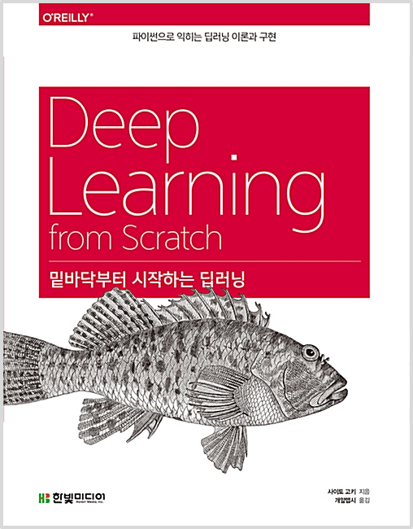

  
  <h1>파이썬 머신러닝 완벽 가이드</h1>
  

    
    
    
  

---

## ✅ CheckLists

- [ ] 책 1회독 하기
- [ ] 실습 내용 GitHub에 남기기
- [ ] 블로그에 책 리뷰하기

---

## 👩‍💻 Study Notes

| 챕터 |                 제목                 | 공부 날짜 |
| :--: | :----------------------------------: | :-------- |
|  1   |             헬로 파이썬              | 2019.10   |
|  2   |               퍼셉트론               | 2019.10   |
|  3   |                신경망                | 2019.11   |
|  4   |             신경망 학습              | 2019.11   |
|  5   |             오차역전파법             | 2019.11   |
|  6   |           학습 관련 기술들           | 2019.11   |
|  7   |          합성곱 신경망(CNN)          | 2020.02   |
|  8   |                딥러닝                | 2020.02   |
|  A   | Softmax-with-Loss 계층의 계산 그래프 |           |
